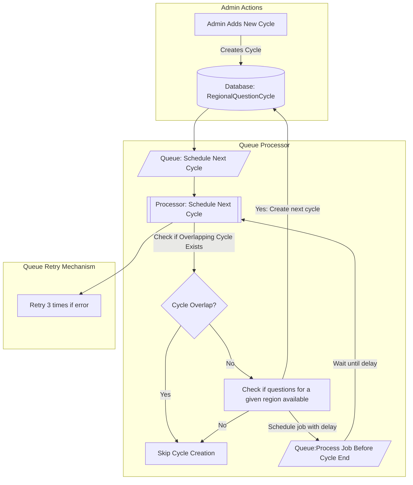
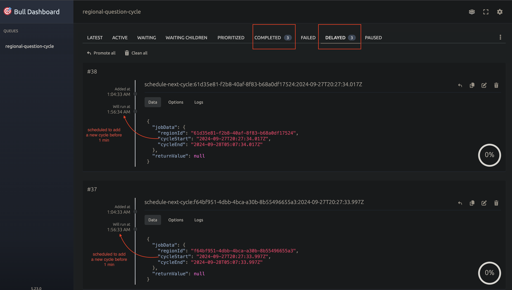

# Quiz Flow

## Introduction

The application implements a cycle scheduling process for assigning questions to users based on their region. The following flowchart illustrates the high-level operations involved in this process:

### Cycles Scheduling Process



The Bullboard interface is available at http://localhost:3000/api/v1/bullboard for monitoring queue activities.




## Usage

Copy `.env.sample` file and rename it to `.env` and update necessary configs

### Install packages

```shell
npm install
npm run build
```

### Migrate database

```shell
npx prisma migrate dev
```

seed required data

```shell
npm run seed:regions
npm run seed:admin
npm run seed:questions
npm run seed:question-assignments
npm run seed:regional-question-cycle
```

### Run the project

```shell
npm run start:prod
```

### Swagger 

The Swagger interface is available at http://localhost:3000/swagger
