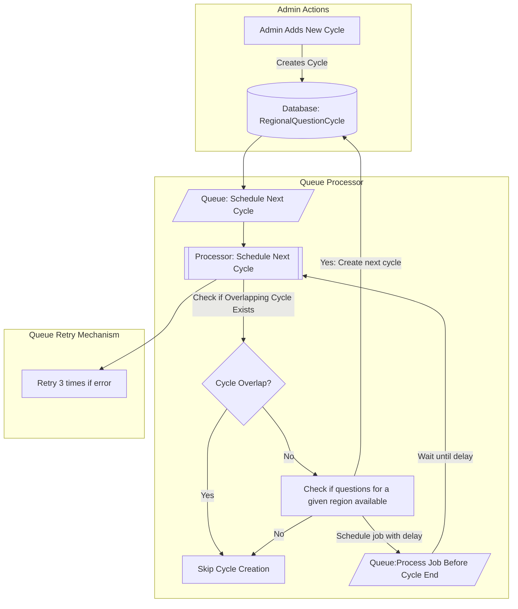

# Quiz Flow

## Introduction

The application implements a cycle scheduling process for assigning questions to users based on their region. The following flowchart illustrates the high-level operations involved in this process:

### Cycles Scheduling Process



The Bullboard interface is available at http://localhost:3000/api/v1/bullboard for monitoring queue activities.


### Overview & Other Details

The goal was to design a dynamic question rotation system where questions are assigned to regions on a cycle basis, with configurable cycle durations. The system allows admins to add new questions and assign them to specific regions, ensuring flexibility in question management.

The architecture revolves around asynchronous job processing to manage question assignments and cycle scheduling in a robust and automated manner.

#### Key Features

1. **Cycle Scheduling**: Admins can manually create cycles or let the system schedule them based on default configurations. This **auto-pilot mode** ensures that cycles run continuously without admin intervention.
2. **Question Management**: Admins can keep adding new questions and assign them to regions dynamically. The system ensures that every region gets its own set of questions for each cycle.
3. **BullMQ Queues**: Jobs are queued for scheduling the next cycle, ensuring cycles are processed in a timely manner. Delayed job processing ensures that the next cycle is scheduled before the current one ends.
4. **Retry and Backoff**: Jobs automatically retry in case of failures with exponential backoff to ensure robust error handling.

#### Additional Details

- After running the last seeder (`npm run seed:regional-question-cycle`), you can monitor the **BullMQ job queue** on **Bullboard** to see jobs being scheduled.
- **Admin Credentials**:
  - Email: `admin@example.com`
  - Password: `Admin@123`

#### Pros

- **Scalable**: Capable of handling large-scale user bases through background job queues.
- **Auto-Pilot Scheduling**: The system schedules cycles automatically, reducing admin workload.
- **Fault-tolerant**: Retry mechanisms ensure reliable job processing even in case of failure.
- **Flexible Management**: Admins can add new questions anytime and let the system handle scheduling.

#### Cons

- **Processing Delays**: Delays in job processing may cause slight lags.

## Usage

Copy `.env.sample` file and rename it to `.env` and update necessary configs

### Install packages

```shell
npm install
npm run build
```

### Migrate database

```shell
npx prisma migrate dev
```

seed required data

```shell
npm run seed:regions
npm run seed:admin
npm run seed:questions
npm run seed:question-assignments
npm run seed:regional-question-cycle
```

### Run the project

```shell
npm run start:prod
```

### Swagger 

The Swagger interface is available at http://localhost:3000/swagger
