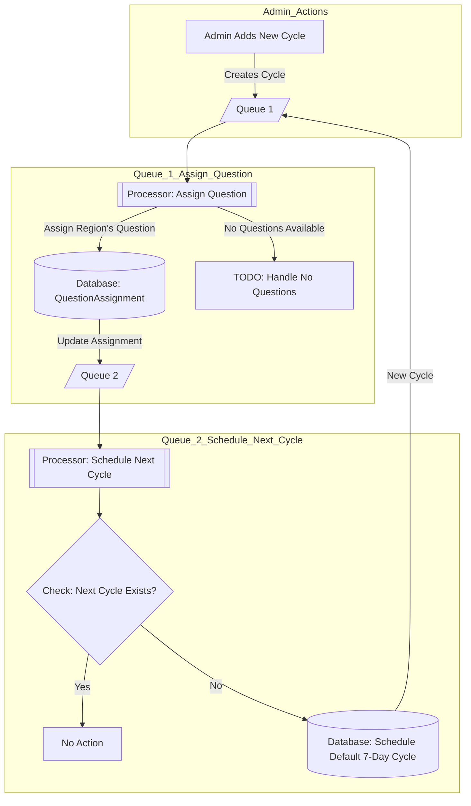

# Quiz Flow

## Usage

Copy `.env.sample` file and rename it to `.env` and update necessary configs

### Install packages

```shell
npm install
npm run build
```

### Migrate database

```shell
npx prisma migrate dev
```

seed required data

```shell
npm run seed:regions
npm run seed:admin
npm run seed:questions
npm run seed:question-assignments
npm run seed:regional-question-cycle
```

### Run the project

```shell
npm run start:prod
```

## About Quiz Flow

### Cycles Scheduling Process


